# 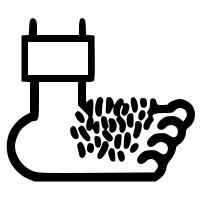 Компания "Туда и обратно" 
<b> Идея: </b> создать адаптивный веб-сайт для вымошленной компании "Туда и обратно", которая под видом турагенсва пропагандирует хорошее кино и всеми любимые франшизы. 

<b> Задача: </b> Сайт адаптируется под экраны декстопных и мобильных версий

<b> Оборудование: </b> HTML, CSS, JS, [бесплатный макет Figma](clck.ru/3CqiEx), как основа

## Шапка 
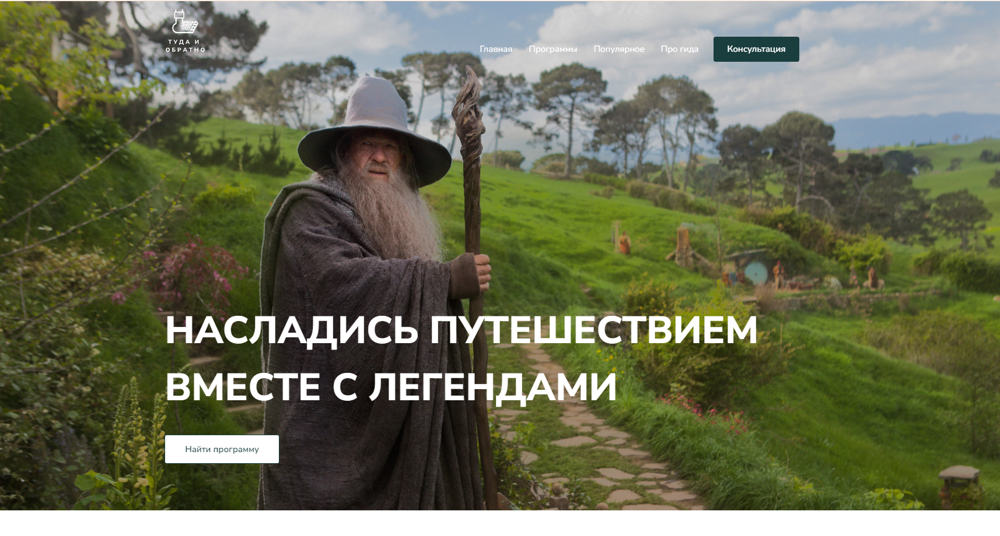

## Раздел "Предложения"
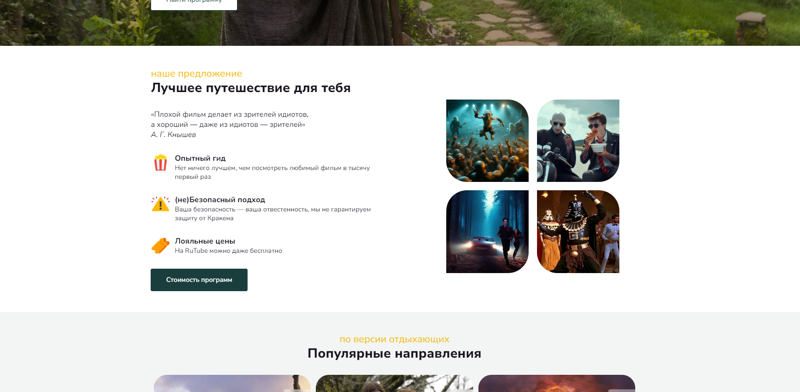

## Раздел "Популярное"
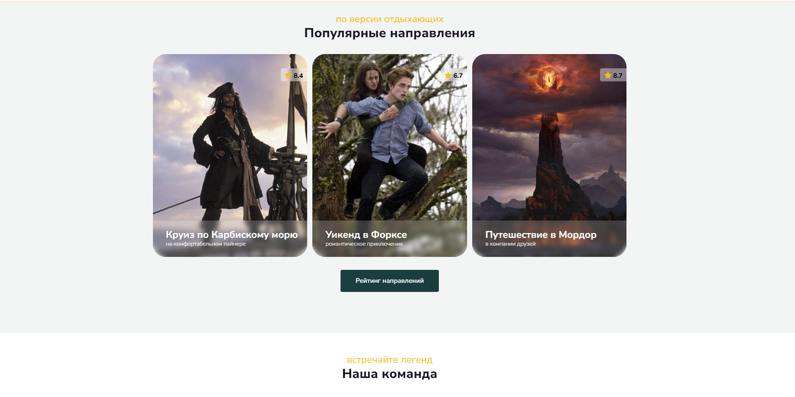

## Раздел "Команда"
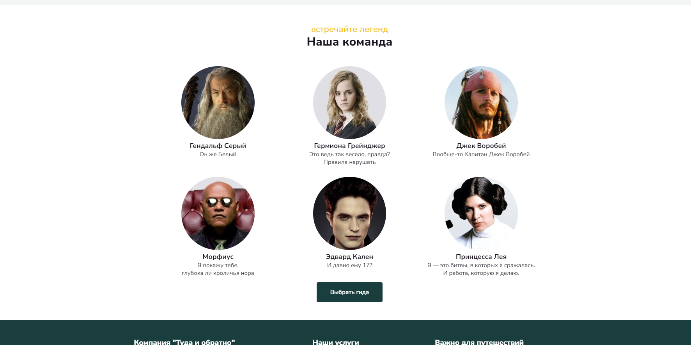

## Футер
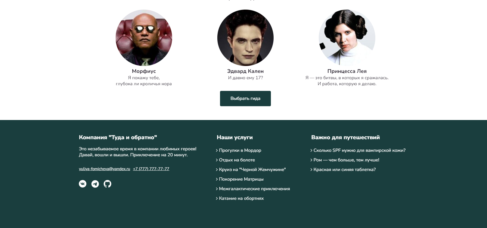

## Мобильная версия 
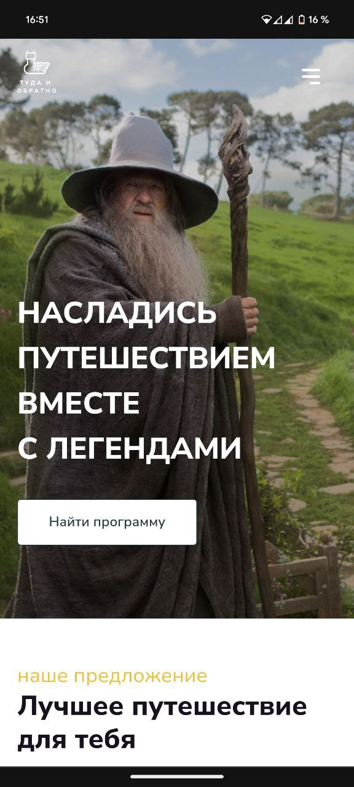 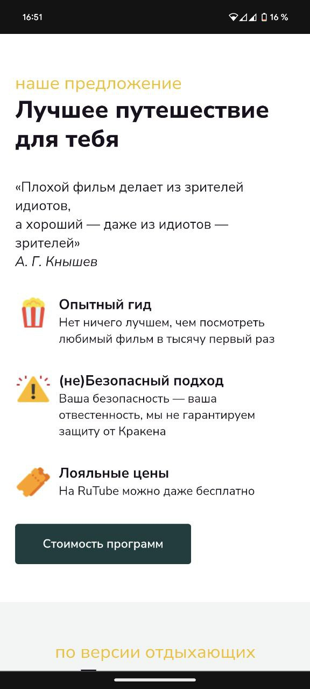 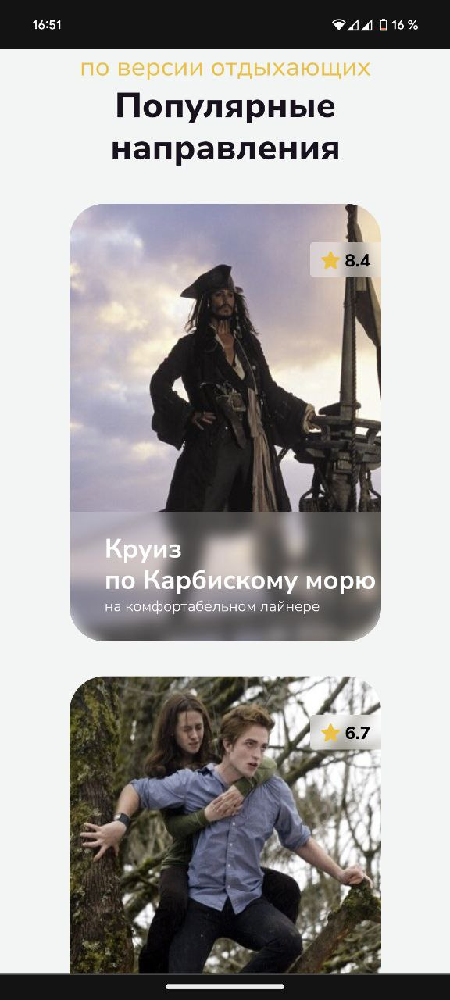 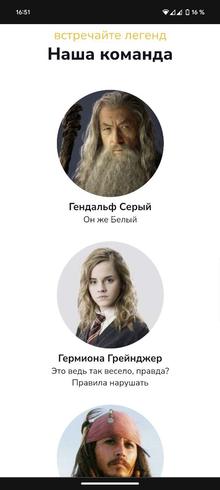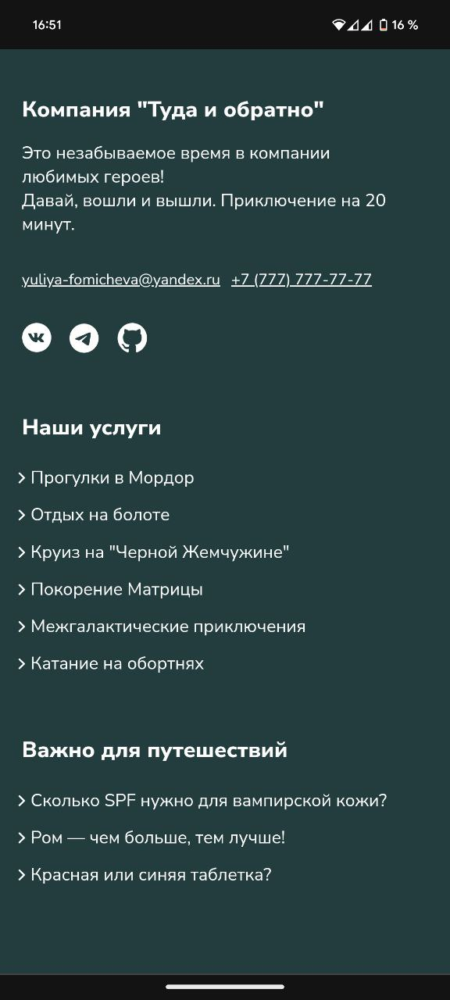
